# Amazon Athena Partition Projection Project

This project is a CDK project that implements Amazon Athena Partition Projection configuration for various logs.

| No | Services                | Log Types | Glue Database |
|----|------------------------|------------|---------------|
| 1  | Application Load Balancer | Access Logs |application_logs_database|
| 2  | AWS WAF                  | Web Acl Traffic Logs|application_logs_database|
| 3  | Amazon VPC               | VPC Flow Logs|network_logs_database|
| 4  | Amazon Route53           | Query Logs|network_logs_database|
| 5  | AWS CloudTrail           |CloudTrail Logs|security_logs_database|
| 6  | AWS Config               |History, Snapshot|security_logs_database|

